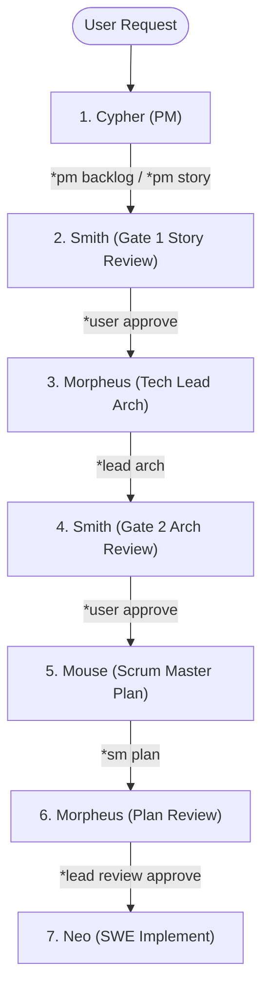

# Evaluation Report: Bloop Skill Effectiveness during Planning & Sprint Initiation

**Audit Target**: `bloop` command loops during sprint planning (`*plan sprint`, `*pm backlog`, `*pm story`, `*lead arch`, `*sm plan`)  
**Auditor**: Bob (Prompt Engineer)  
**Date**: 2026-06-21  

---

## 1. Planning Workflow Analysis

The `bloop` skill manages multi-persona transitions to initiate and plan sprints. A typical planning loop (observed during Sprint 26 initiation in `agents/CHAT.md` lines 2735 to 2795) runs through the following sequence:

### Trace Metrics:
*   **Total Handoff Transitions**: 6 transitions (7 separate agent activations).
*   **Time & Token Overhead**: Every transition requires writing `context.md`, `current_task.md`, `next_steps.md`, creating a task summary markdown file, and posting to `CHAT.md`.
*   **Interactive Gates**: 2 manual gates (Smith Story Gate 1 and Smith Architecture Gate 2) and 1 peer review gate (Morpheus Plan Review).

---

## 2. Inefficiencies & Coordination Waste

While the planning sequence ensures high alignment and strict compliance with the architecture and HCI gates, it introduces severe inefficiencies for minor or technical-debt sprints:

1.  **Low-Density Agent Turns (Approval Overhead)**:
    *   *Smith Gate 1 Review*: Read stories $\rightarrow$ Approve (1 model call).
    *   *Smith Gate 2 Review*: Read architecture $\rightarrow$ Approve (1 model call).
    *   *Morpheus Plan Review*: Read task plan $\rightarrow$ Approve (1 model call).
    *   These agents perform minimal work but incur the full State Management Protocol (SMP) tax of saving and loading context.
2.  **Lock-Step Sequential Latency**:
    *   Planning is entirely linear. If Smith is blocked or takes a turn to ask a minor question, the entire planning sequence stops. Mouse cannot begin task breakdown until Smith approves Morpheus's architecture, even if the general task boundaries are obvious.
3.  **Redundant Document Footprints**:
    *   Sprint 26 stories are duplicated or split across:
        *   `agents/cypher.docs/SPRINT_26_USER_STORIES.md` (Stories)
        *   `agents/morpheus.docs/SPRINT_26_ARCHITECTURE.md` (Architecture)
        *   `agents/mouse.docs/SPRINT_26_TASKS.md` (Task breakdown)
        *   `task.md` (Task board copy)
    *   Reading all these files in subsequent steps creates significant token blowup for implementing agents.

---

## 3. Trace Effectiveness Score (TES) Rubric

| Category | Max Points | Deductions | Score | Notes |
|---|---|---|---|---|
| **Correctness & Success** | 100 | 0 | 100 | Successfully broke down stories, architecture, and task plan into a green baseline implementation. |
| **Resource Waste** | - | -15 | 85 | Deducted for 6 sequential switches with low-density turns (Smith & Morpheus approval gates) and redundant document footprints. |
| **Protocol Adherence** | - | -3 | 97 | SMP state files are updated correctly, but Mouse/Cypher/Morpheus state sync has slight latency during transitions. |
| **Final Score** | **100** | **-18** | **82 / 100** | **Sub-optimal (Target is >= 90)** |

---

## 4. Bottleneck Diagnosis

*   **Rule Rigidness**: The protocol does not distinguish between a major feature sprint (e.g. adding Flutter support) and a minor refactoring or tech-debt sprint (e.g. Sprint 26). Both run the exact same 6-step planning sequence.
*   **Approval-Gate Granularity**: Separating Story approval, Architecture approval, and Plan approval into separate turns wastes tokens and context space on metadata writing.

---

## 5. Recommended Planning Optimizations

To improve planning velocity and reduce token waste, Bob proposes the following adjustments to the planning guidelines:

### A. Fast-Track Planning Mode (Maintenance Sprints)
Add a guideline to `AGENTS.md` and `GEMINI.md` defining **Sprint Planning Tiers**:
*   **Tier 1 (Major Sprints)**: Standard 6-step planning loop (Cypher $\rightarrow$ Smith $\rightarrow$ Morpheus $\rightarrow$ Smith $\rightarrow$ Mouse $\rightarrow$ Morpheus $\rightarrow$ Neo).
*   **Tier 2 (Minor/Maintenance Sprints)**: Fast-track planning loop:
    1.  **Cypher/Morpheus Unified Planning**: A single agent (Cypher or Morpheus) writes both the User Stories and the Architecture in a single turn.
    2.  **Smith/Mouse Unified Review**: Smith reviews stories/architecture and Mouse generates the task plan in the same turn, handing off directly to Neo.
    *   *Reduction*: Handoff count drops from 6 to 2.

### B. Single Source of Truth for Tasks (`task.md`)
*   Eliminate separate task files like `mouse.docs/SPRINT_X_TASKS.md`. Mouse must write tasks directly into the project-level `task.md`. Personas read `task.md` directly, avoiding directory scanning and state duplication.

### C. Collaborative Gate Review
*   Combine Gate 1 (Story) and Gate 2 (Architecture) reviews into a single turn for Smith when stories have direct architectural implications (e.g. refactoring tasks).

---

## 6. Optimization Implementation Plan

1.  **Update Mouse Prompt** ([agents/mouse.docs/SKILL.md](file:///home/drusifer/Projects/via/agents/mouse.docs/SKILL.md)):
    *   Instruct Mouse to write sprint tasks directly to [task.md](file:///home/drusifer/Projects/via/task.md) and avoid creating secondary sprint task files in `mouse.docs/`.
    *   Define Tier 2 Sprint Planning fast-track procedures.
2.  **Update Cypher Prompt** ([agents/cypher.docs/SKILL.md](file:///home/drusifer/Projects/via/agents/cypher.docs/SKILL.md)):
    *   Define Tier 2 Unified Planning cooperation instructions with Morpheus.
3.  **Update Global Guidelines** ([AGENTS.md](file:///home/drusifer/Projects/via/AGENTS.md) and [GEMINI.md](file:///home/drusifer/Projects/via/GEMINI.md)):
    *   Add the **Sprint Planning Tiers** section detailing Tier 1 and Tier 2 loops.
