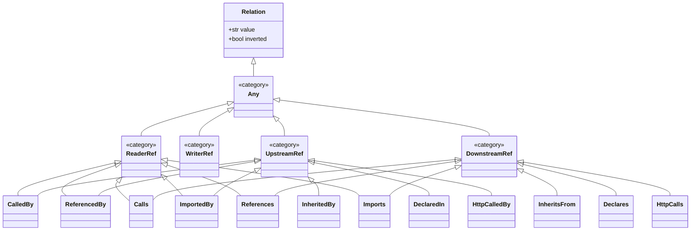

Architecture design for implementing a class-based relationship type hierarchy in VIA.

TLDR:
    Problem: Relationship queries are limited to matching single, concrete string keys. Expressive queries like "blast radius" require finding both upstream (incoming) and downstream (outgoing) relationships across multiple types.
    Solution: Abstract relationship types into an object-oriented class hierarchy. The query parser resolves requested type queries against this hierarchy using `issubclass` matching, allowing the database store to compile generic relationship queries using SQL IN and UNION operators.

# Design: Relationship Type Hierarchy

## Actual Requirements

To support query expressiveness for users and AI agents, VIA needs to support queries like **blast radius** (upstream and downstream references) without requiring hard-coded schema changes in the query engine or complex command chaining on the client side:
- **Upstream References**: Callers, referencers, importers, or subclasses that depend on the targeted symbol.
- **Downstream References**: Callees, referencees, imported modules, or parent classes that the targeted symbol utilizes.

This relationship mapping must be extensible, allowing new relationship types to be added simply by defining new classes in the appropriate place in the hierarchy.

---

## Architecture Design

### 1. Class-Based Relationship Hierarchy
We replace the flat `ReferenceType` enum in [relationship_types.py](file:///home/drusifer/Projects/via/via/core/relationship_types.py) with an object-oriented class hierarchy:



### 2. Category Definitions
- **`Any`**: Root category matching all relationship types.
- **`UpstreamRef`**: Represents incoming edges. For a targeted symbol `T`, this finds symbols that point *to* `T` (e.g. callers, referencers, subclasses).
- **`DownstreamRef`**: Represents outgoing edges. For a targeted symbol `T`, this finds symbols that `T` points *to* (e.g. callees, referencees, parent classes).
- **`ReaderRef`**: Represents dereferencing or read operations.
- **`WriterRef`**: Represents assignments or mutations.

### 3. Resolution and SQL Compilation

During stage parsing in [parser.py](file:///home/drusifer/Projects/via/via/pipeline/parser.py), the query parser resolves the requested relationship string to a class in the hierarchy. It then expands it to the matched concrete leaf subclasses and groups them by traversal direction (`inverted` flag):

#### Scenario A: Unified Direction
If all resolved concrete relationships share the same direction (e.g. `--via upstream-ref`), the query compiles to a single database execution in [store.py](file:///home/drusifer/Projects/via/via/db/store.py):
```sql
SELECT s.symbol_name, s.symbol_type, s.file_path, s.line_number
FROM symbol_references r
JOIN symbols s ON r.from_symbol_id = s.id
JOIN symbols t ON r.to_symbol_id = t.id
WHERE r.reference_type IN ('calls', 'references', 'imports', 'inherits-from')
  AND t.symbol_name = ?
```

#### Scenario B: Mixed/Combined Directions (e.g. `blast` or `any`)
If the query targets both directions, [DatabaseStore](file:///home/drusifer/Projects/via/via/db/store.py) compiles a `UNION` query:
```sql
SELECT * FROM (
    -- Forward relationships (Downstream)
    SELECT s.symbol_name, s.symbol_type, s.file_path, s.line_number ...
    FROM symbol_references r
    JOIN symbols s ON r.from_symbol_id = s.id
    JOIN symbols t ON r.to_symbol_id = t.id
    WHERE r.reference_type IN ('calls', 'references', 'imports', 'inherits-from')
      AND t.symbol_name = ?
    
    UNION
    
    -- Inverted relationships (Upstream)
    SELECT t.symbol_name, t.symbol_type, t.file_path, t.line_number ...
    FROM symbol_references r
    JOIN symbols s ON r.from_symbol_id = s.id
    JOIN symbols t ON r.to_symbol_id = t.id
    WHERE r.reference_type IN ('calls', 'references', 'imports', 'inherits-from')
      AND s.symbol_name = ?
)
ORDER BY file_path, line_number
LIMIT ?
```

---

## 4. The "blast" Canned Query Definition
Once this hierarchy design is implemented, the `"blast"` canned query can be specified entirely via JSON configuration in `.via/canned/blast.json` without modifying Python code:
```json
{
  "name": "blast",
  "argv": [
    "-mg", "*",
    "--via", "any-ref",
    "-mg", "{symbol}"
  ]
}
```
*(where `any-ref` maps to a composite relationship class matching all leaf relationship types across both directions).*

---

## 5. Files to Modify Checklist
- [via/core/relationship_types.py](file:///home/drusifer/Projects/via/via/core/relationship_types.py): Replace string enum with class-based hierarchy.
- [via/pipeline/parser.py](file:///home/drusifer/Projects/via/via/pipeline/parser.py): Update `PipelineParser` to resolve string inputs against the hierarchy classes.
- [via/db/store.py](file:///home/drusifer/Projects/via/via/db/store.py): Modify `query_relationships` and `query_negative_relationships` to construct SQL queries using `IN` and `UNION` based on resolved relationships and directions.
- [via/pipeline/executor.py](file:///home/drusifer/Projects/via/via/pipeline/executor.py): Update stage builders and executor params compilation.
