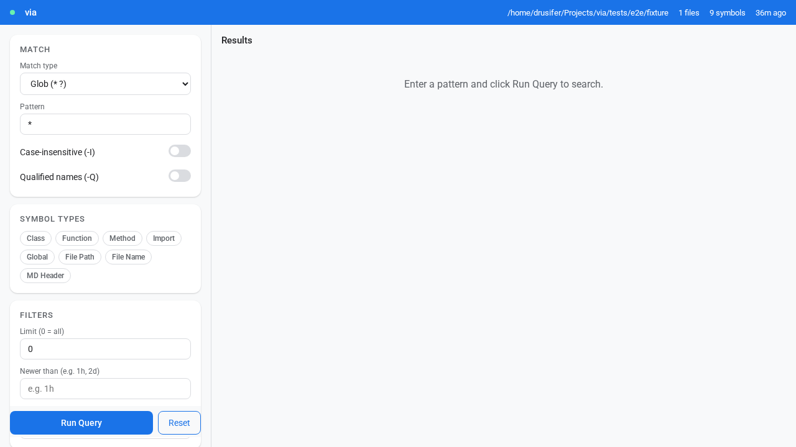
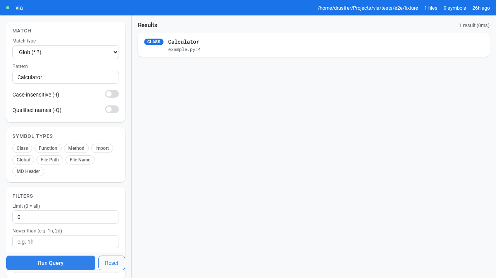
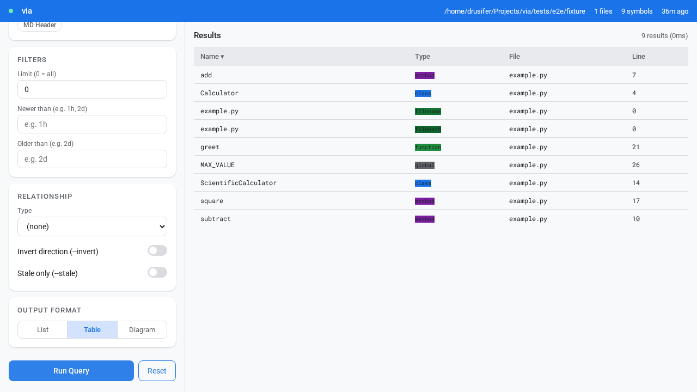
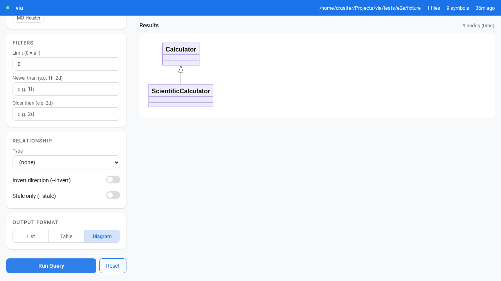

# VIA User Guide

TLDR: Complete reference for indexing, searching, and navigating codebases using CLI, Web UI, and MCP.

## Table of Contents

1. [Installation](#installation)
2. [Quick Start](#quick-start)
3. [Indexing](#indexing)
4. [Searching with Pipeline Syntax](#searching-with-pipeline-syntax)
5. [Output Formats](#output-formats)
6. [Context Lines](#context-lines)
7. [Relationship Queries](#relationship-queries)
8. [Container Queries (--via declares)](#container-queries---via-declares)
9. [Temporal Queries](#temporal-queries)
10. [Watch Mode](#watch-mode)
11. [MCP Mode (AI Agent Integration)](#mcp-mode-ai-agent-integration)
12. [Web Interface](#web-interface)
13. [Legacy Subcommand Syntax](#legacy-subcommand-syntax)
14. [Practical Examples](#practical-examples)
15. [20 Real-World Queries](#20-real-world-queries)
16. [Troubleshooting](#troubleshooting)

---

## Installation

```bash
# Clone and install
git clone https://github.com/your-org/via.git
cd via
python -tm venv .venv
source .venv/bin/activate
pip install -e .

# Verify
via --version
```

---

## Quick Start

```bash
# 1. Index your codebase
cd /path/to/your/python/project
via index .

# 2. Search for symbols
via -mg '*' -tc              # All classes
via -mg 'test_*' -tf         # Test functions
via -mg '*save*' -tm         # Methods containing "save"

# 3. View source code
via -mg 'User' -tc -oF    # Class with syntax highlighting
via -mg 'main' -tf -oR    # Function as raw source
```

---

## Indexing

### Basic Usage

```bash
# Index current directory
via index .

# Index specific directory
via index /path/to/project

# Force full re-index (ignore timestamps)
via index . --force

# Verbose output
via index . -v
via index . -vv    # More detail
via index . -vvv   # Even more detail
```

### Supported Languages

| Language | Extensions | Symbols Extracted |
|----------|-----------|-------------------|
| Python | `.py`, `.pyx`, `.pyi` | classes, methods, functions, imports, globals |
| JavaScript | `.js`, `.mjs`, `.cjs`, `.jsx` | classes, methods, functions, imports, globals |
| TypeScript | `.ts`, `.tsx` | classes, interfaces, enums, methods, functions, imports, globals, type aliases |
| Markdown | `.md`, `.markdown` | headers |

**Default excluded directories**: `node_modules/`, `dist/`, `.next/`, `.nuxt/`, `.svelte-kit/`, `coverage/`, `.turbo/`, `__pycache__/`, `.git/`. Add more with `--exclude`.

### What Gets Indexed

| Symbol Type | Example | Description |
|-------------|---------|-------------|
| class | `class User:` / `class Server extends Base {}` | Class definitions (Python + JS/TS) |
| method | `def save(self):` / `render() {}` | Methods inside classes |
| function | `def main():` / `function main() {}` / `const fn = () => {}` | Top-level functions |
| import | `import json` / `import { X } from 'y'` | Import statements |
| global | `MAX_SIZE = 100` / `const PORT = 3000` | Module-level variables |
| header | `## Section` | Markdown headers |

### Incremental Updates

VIA tracks file modification times. Only changed files are re-indexed:

```bash
$ via index .
Files indexed: 50

# Make changes to 2 files...

$ via index .
Files indexed: 2, Files skipped: 48
```

---

## Searching with Pipeline Syntax

The recommended way to search uses **pipeline syntax**:

```
via -m<X> PATTERN [-t<Y>...] [-o<Z>] [-f<W>] [OPTIONS]
```

You can specify multiple type flags to search for symbols of different types. For example, `via -mg '*' -tc -tf` will search for all classes and functions.

Use `--via <rel>` to add a relationship stage — see [Relationship Queries](#relationship-queries).

### Pattern Flags

| Flag | Type | Wildcards | Example |
|------|------|-----------|---------|
| `-mg` | Glob (default) | `*` any, `?` single | `-g '*save*'` |
| `-ms` | SQL LIKE | `%` any, `_` single | `-s '%save%'` |
| `-mr` | Regex | Full regex | `-r '^test_.*'` |

### Type Flags

| Flag | Type | Description |
|------|------|-------------|
| `-tc` | class | Class definitions |
| `-tm` | method | Class methods |
| `-tf` | function | Top-level functions |
| `-ti` | import | Import statements |
| `-tg` | global | Module-level variables |
| `-tF` | filepath | Full file paths |
| `-tN` | filename | File names only |
| `-tH` | header | Markdown headers |

**Omit type flags to search all symbol types.**

### Options

| Option | Description | Default |
|--------|-------------|---------|
| `-n N` | Limit results | 10 |
| `-n 0` | Unlimited results | - |
| `-I` | Case-insensitive matching (all patterns are case-sensitive by default) | Off |
| `-Q` | Match against qualified name (useful with `-tF` for full-path matching) | Off |
| `--newerthan DURATION` | Only symbols from files modified within duration (e.g. `1h`, `2d`, `1w`) | Off |
| `--olderthan DURATION` | Only symbols from files NOT modified within duration | Off |

### Examples

```bash
# All classes
via -mg '*' -tc

# Classes ending with "Manager"
via -mg '*Manager' -tc

# Test functions (first 5)
via -mg 'test_*' -tf -n 5

# Methods containing "save" (case-insensitive)
via -mg '*save*' -tm -I

# All symbols matching "main"
via -mg '*main*'

# Unlimited results
via -mg '*' -tf -n 0
```

---

## Output Formats

Output flags control how results are rendered:

| Flag | Format | Description |
|------|--------|-------------|
| `-oL` | List | One result per line (default) |
| `-oT` | Table | ASCII table format |
| `-oR` | Raw | Source code extraction |
| `-oF` | Formatted | Syntax-highlighted source |
| `-oU` | Usage | Renders the docstring of the matched symbol |
| `-oJ` | JSON | JSON array of symbol objects (AI agents / MCP) |

### Format Modifiers (-f<X>)

These secondary flags control the output encoding (for use with `-oR`, `-oF`, `-oT`, etc.):

| Flag | Format |
|------|--------|
| `-fa` | ASCII (terminal colors) |
| `-fm` | Markdown |
| `-fh` | HTML |
| `-fp` | PNG image |

### List Output (Default)

```bash
via -mg '*' -tc -n 3
```

Output:
```
class:via/core/types.py:35:MatchOp:@890+120
class:via/core/types.py:58:MatchResult:@1234+340
class:via/db/store.py:42:DatabaseStore:@1456+8900
```

### Table Output

```bash
via -mg '*Record' -tc -oT
```

Output:
```
| Type  | Name               | File                    | Line | Qualified Name       |
|-------|--------------------|-------------------------|------|----------------------|
| class | MatchRecord        | via/core/match_record.py | 41  | MatchRecord          |
| class | ClassMatchRecord   | via/core/match_record.py | 89  | ClassMatchRecord     |
| class | MethodMatchRecord  | via/core/match_record.py | 112 | MethodMatchRecord    |
```

### Raw Source Output

```bash
via -mg 'extract_source' -tf -oR
```

Output:
```
############################################################
# via/renderers/utils/source_extraction.py:21-67
#     function *extract_source*
############################################################
def extract_source(
    file_path: str,
    byte_offset: Optional[int],
    byte_length: Optional[int],
    before_context: int = 0,
    after_context: int = 0,
    read_full_file: bool = False
) -> str:
    """Extract source code from file."""
    ...
```

### Formatted Output (Syntax Highlighting)

```bash
via -mg 'Renderer' -tc -oF -n 1
```

Output shows syntax-highlighted Python code with ANSI colors.

---


### Usage Output (Docstrings)

```bash
via -mg 'MyClassName' -tc -oU
```

Output:
```
############################################################
# via/my_module.py:123
#     class *MyClassName*
############################################################
This is the docstring for MyClassName.
It can be multiple lines.
```

## Context Lines

Show surrounding code with raw (`-oR`) or formatted (`-oF`) output:

| Flag | Description |
|------|-------------|
| `-B N` | N lines before match |
| `-A N` | N lines after match |
| `-C N` | N lines before AND after |

### Examples

```bash
# Show 3 lines before the match
via -mg 'main' -tf -oR -B 3

# Show 5 lines after the match
via -mg 'User' -tc -oF -A 5

# Show 2 lines on each side
via -mg 'save' -tm -oR -C 2
```

### Disable Headers

Use `--nodelims` to remove the delimiter headers between matches:

```bash
via -mg '*' -tf -oR --nodelims
```

---

## Relationship Queries

VIA can trace relationships between symbols: inheritance, function calls, imports, references, and container membership. This lets you navigate code structure, not just search for names.

### Syntax

```
via <anchor-args> --via <rel> <result-args>
via <anchor-args> --sans <rel> <result-args>
```

- **anchor** (before `--via`/`--sans`): The known symbol — what you're querying about
- **result** (after `--via`/`--sans`): What you want to find (filter with pattern + type flags)
- **`--via <rel>`**: Return subjects that **have** the relationship to the anchor
- **`--sans <rel>`**: Return subjects with **no** such relationship (NOT EXISTS)
- **`--not`**: Negate the immediately following pattern flag (`-mg`/`-mr`/`-ms`)
- **`-V <rel>`** / **`-S <rel>`**: Short forms of `--via` / `--sans`

### Relationship Types

| Relationship | `--via` / `-V` value | Description |
|---|---|---|
| Inheritance | `inherits-from` | Classes that inherit from (subclasses of) the anchor |
| Calls | `calls` | Functions/methods that call the anchor |
| Imports | `imports` | Files/modules that import the anchor |
| References | `references` | Symbols that reference the anchor in their body |
| Container membership | `declares` | Members declared inside the anchor (file/class/function) |

### `--sans`: Negative Relationship (NOT EXISTS)

`--sans <rel>` returns subjects that have **no** relationship edge to anything matching the object pattern. Uses a SQL NOT EXISTS subquery.

```bash
# Root classes — no parent class at all
via -mg '*' -tc --sans inherits-from -mg '*' -tc

# Functions that call nothing
via -mg '*' -tf --sans calls -mg '*' -tf

# Functions that reference nothing (leaf implementations)
via -mg '*' -tf --sans references -mg '*' -tf
```

### `--not`: Negate a Pattern Flag

`--not` negates the match pattern immediately following it. Useful for exclusion patterns.

```bash
# All methods NOT starting with underscore
via -mg '*' -tm --not -mg '_*' -tm
```

### `--stale`: Cross-Stage Temporal Filter

`--stale` filters relationship results to those where the **result symbol's file is older than the anchor's file**. Use it to find stale dependencies — code that was last touched *before* the thing it depends on.

```bash
# Find test files that haven't been updated since the classes they test changed
via -mg '*' -tc --via inherits-from -mg 'test_*' -tf --stale

# Find subclasses older than their base class
via -mg 'Base*' -tc --via inherits-from -mg '*' -tc --stale

# Find callers that pre-date the function they call
via -mg 'my_func' -tf --via calls -mg '*' -tf --stale
```

> **Note**: `--stale` only applies to relationship queries. On a plain match query it is a no-op. If mtime data is missing, rebuild the index with `via index --force`.

### Inheritance Examples

```bash
# Find all classes that inherit from BaseClass
via -mg 'BaseClass' -tc --via inherits-from -mg '*' -tc

# Find children of any class matching *Base*
via -mg '*Base*' -tc --via inherits-from -mg '*' -tc

# Filter: only show children matching "Child*"
via -mg 'BaseClass' -tc --via inherits-from -mg 'Child*' -tc

# Root classes (no parent)
via -mg '*' -tc --sans inherits-from -mg '*' -tc
```

### Import Examples

```bash
# Find all files that import typing
via -mg 'typing' --via imports -mg '*' -tF

# Find all files importing dataclasses, show as table
via -mg 'dataclasses' --via imports -mg '*' -tF -oT
```

### Call Examples

```bash
# Find all functions that call helper_func
via -mg 'helper_func' -tf --via calls -mg '*' -tf

# Find all callers of a method
via -mg 'save' -tm --via calls -mg '*' -tm

# Functions that call nothing
via -mg '*' -tf --sans calls -mg '*' -tf
```

### Reference Examples

```bash
# Find all functions that reference a constant
via -mg 'MAX_RETRIES' -tg --via references -mg '*' -tf

# Find all referencers of a symbol
via -mg 'process_data' -tf --via references -mg '*'

# Functions that reference nothing (leaf implementations — no external dependencies)
via -mg '*' -tf --sans references -mg '*' -tf
```

### Combining with Output Formats

```bash
# Inheritance tree as table
via -mg 'BaseClass' -tc --via inherits-from -mg '*' -tc -oT

# Show source of all callers
via -mg 'validate' -tf --via calls -mg '*' -tf -oR
```

---

## Python API

Use `ViaQueryBuilder` plus `ViaRunner` when you want to run via queries from Python code. This API keeps the same semantics as the CLI; it is a construction helper, not a new query language.

### Plain Query Example

```python
from via import ViaQueryBuilder, ViaRunner

query = (
    ViaQueryBuilder()
    .glob("*Service")
    .classes()
    .limit(10)
    .build()
)

records = list(ViaRunner(db_store).run(query))
```

### Relationship Query Example

```python
from via import ViaQueryBuilder, ViaRunner

query = (
    ViaQueryBuilder()
    .glob("Base")
    .classes()
    .via("inherits-from")
        .glob("*")
        .classes()
    .done()
    .build()
)

records = list(ViaRunner(db_store).run(query))
```

---

## Container Queries (`--via declares`)

`--via declares` queries "what lives inside this container?" — file→symbols, class→methods, function→nested functions.

### Syntax

```
via -m<X> CONTAINER_PATTERN -t<container> --via declares -t<member>
```

Valid container types: `-tF` (filepath), `-tN` (filename), `-tc` (class), `-tf` (function)

### Examples

```bash
# All classes defined in store.py
via -mg 'store.py' -tN --via declares -tc

# All methods of DatabaseStore
via -mg 'DatabaseStore' -tc --via declares -tm

# All functions in service files
via -mg '*service*' -tF --via declares -tf -n 0

# All methods in executor.py, as table
via -mg 'executor.py' -tN --via declares -tm -oT -n 0

# All test functions across all test files
via -mg 'test_*.py' -tN --via declares -tf -n 0
```

> **Note**: All patterns are case-sensitive. Use `-I` for case-insensitive matching.

---

## Temporal Queries

Filter symbols by when their source file was last modified. Useful for finding recently changed code or stale symbols.

### Syntax

```
via -m<X> PATTERN -t<Y> --newerthan DURATION
via -m<X> PATTERN -t<Y> --olderthan DURATION
```

### Duration Format

Human-friendly durations: `30s`, `5m`, `2h`, `1d`, `1w`

| Unit | Example | Meaning |
|------|---------|---------|
| `s` | `30s` | 30 seconds |
| `m` | `5m` | 5 minutes |
| `h` | `2h` | 2 hours |
| `d` | `1d` | 1 day |
| `w` | `1w` | 1 week |

### Examples

```bash
# Classes in files modified in the last hour
via -mg '*' -tc --newerthan 1h

# All symbols changed today
via -mg '*' --newerthan 1d -n 0

# Functions in files not touched in over a week (stale code)
via -mg '*' -tf --olderthan 1w

# Recently changed test functions
via -mg 'test_*' -tf --newerthan 2d
```

> **Note**: Timestamps are per-symbol. Watch mode updates symbol mtimes as files change — only modified symbols get new timestamps, not all symbols in the file.

---

## Watch Mode

Keep the index automatically up-to-date as you edit files.

```bash
via index . -w     # Index then watch — re-indexes on every save
```

VIA detects file changes using watchdog with a 1-second debounce. Changed files are re-indexed automatically; deleted files are fully removed (symbols and relationships). Press Ctrl-C to stop.

---

## MCP Mode (AI Agent Integration)

VIA can run as an MCP (Model Context Protocol) server, exposing a `via_query` tool to Claude Code and other MCP clients over JSON-RPC 2.0 via stdio. The index is always current — watch mode starts automatically when the server starts.

### Setup

```bash
# Register via as an MCP server in the current project
via install mcp

# Check registration status
via status mcp

# Remove registration
via uninstall mcp
```

`via install mcp` writes `.mcp.json` in the project root (next to `.via/`). Claude Code reads this at session startup and calls `tools/list` to discover the `via_query` tool.

### Starting the Server

```bash
via mcp serve              # Serve from current directory
via mcp serve /path/to/project   # Serve a specific project
```

The server starts WatchService in a background thread (index stays current) and listens for JSON-RPC 2.0 on stdin/stdout. Exit by closing stdin (Claude Code does this automatically on session end).

### Calling via_query

Claude Code can call the tool with the same CLI args you would use on the command line:

```json
{"args": ["-mg", "*Parser*", "-tc"]}         // All Parser classes
{"args": ["-mg", "*", "-tf", "-n", "20"]}   // First 20 functions
{"args": ["stats"]}                           // Database statistics
```

Results are returned as a JSON array of symbol objects with fields: `symbol_name`, `symbol_type`, `file_path`, `line_number`, `byte_offset`, `byte_length`, `qualified_name`, `parent_name`.

### Inspecting the Schema

```bash
via mcp schema             # Print the via_query tool schema as JSON
```

This shows exactly what Claude Code sees when it calls `tools/list`.

---

## Web Interface

VIA includes a browser-based UI for interactive symbol search. It mirrors all CLI capabilities with point-and-click controls.

### Starting the Web UI

```bash
via web                # Start on default port (8080)
via web --port 9000    # Custom port
```

Open `http://localhost:8080` in your browser. The server auto-starts watch mode — the index stays current as you edit files.

### Layout

The UI is split into two panels:

**Left — Controls**: Build your query interactively:
- **Match**: Pattern input, match type (Glob/Regex/SQL LIKE), Case-insensitive (`-I`), Qualified names (`-Q`)
- **Symbol Types**: Chips for `Class`, `Function`, `Method`, `Import`, `Global`, `File Path`, `File Name`, `MD Header`
- **Filters**: Limit, Newer than (`--newerthan`), Older than (`--olderthan`)
- **Relationship**: Type dropdown (`--via <rel>`), Negative relationship toggle (`--sans`), Stale only toggle (`--stale`)
- **Output Format**: List / Table / Diagram toggle buttons
- **Run Query** / **Reset** (sticky at bottom of panel — always reachable)

**Right — Results**: Live query output in the selected format:
- **List**: Default card view — symbol name, colored type badge, `file:line` location
- **Table**: Sortable columns (Name, Type, File, Line) with colored type badges
- **Diagram**: Mermaid UML class diagram (inheritance trees, rendered live)

**Top — Status Bar**: Indexed directory, file count, symbol count, time since last index, and a live watch indicator (green dot = watching).

### Screenshots

**Initial load** — controls panel ready, results panel waiting for input:



**List results** — default view after querying for `Calculator`:



**Table format** — all 9 symbols as a sortable table; Relationship section showing `--sans` and `--stale` toggles:



**Diagram format** — Mermaid UML inheritance diagram rendered in the results panel:



**Error state** — shown when the database is unavailable (run `via index .` first):


---

## Legacy Subcommand Syntax

The older subcommand syntax still works:

```bash
# Index
via index .
via index /path/to/project --force

# Match
via match '*save*' -t method
via match 'test_*' -t function -g
via match '%User%' -t class -s -I
```

**Note:** Pipeline syntax is recommended for new usage.

---

## Practical Examples

### Find All Test Functions

```bash
via -mg 'test_*' -tf
```

### Find Classes in a Module Pattern

```bash
via -mg '*Handler' -tc -oT
```

### View a Specific Class Implementation

```bash
via -mg 'DatabaseStore' -tc -oF
```

### Find Methods and Show Context

```bash
via -mg '*save*' -tm -oR -C 5
```

### Count Symbols

```bash
# Count all classes
via -mg '*' -tc -n 0 | wc -l

# Count all methods
via -mg '*' -tm -n 0 | wc -l

# Count test functions
via -mg 'test_*' -tf -n 0 | wc -l
```

### Find Unique Files with Matches

```bash
via -mg '*save*' -tm -n 0 | cut -d: -f2 | sort -u
```

### Search Imports

```bash
# Find all typing imports
via -mg '*typing*' -ti

# Find json imports
via -mg 'json' -ti
```

### Find Global Constants

```bash
# Find all globals
via -mg '*' -tg

# Find uppercase constants
via -mg '*_*' -tg
```

### Find Files by Name or Path

```bash
# Find test files (by filename)
via -mg '*test*' -tN

# Find files in a directory (by full path — requires -Q)
via -mg 'via/core/*' -tF -Q

# Find all Python files under a subdirectory
via -mg '*/pipeline/*' -tF -Q -n 0
```

### Complex Pipeline: Search and Format

```bash
# Find all Renderer classes with syntax highlighting
via -mg '*Renderer' -tc -oF

# Find save methods, show as table
via -mg '*save*' -tm -oT

# Find functions, show raw source with 3 lines context
via -mg 'main' -tf -oR -C 3
```

---

## 20 Real-World Queries

These are the questions developers reach for constantly when navigating a real codebase.
Each entry shows the exact `via` command that answers it.

### Orientation — New to a Codebase

#### 1. What are the top-level classes in this project? Give me a map of the domain.

```bash
via -mg "*" -tc
via -mg "*" -tc -oT          # table format — easier to scan
via -mg "*" -tc -oD          # Mermaid diagram — shows inheritance
```

#### 2. Which file is the entry point? What does it call first?

```bash
# Find the entry-point file
via -mg "__main__*" -tN

# See all functions defined in it
via -mg "*" -tf --via declares -mg "__main__*" -tN

# See what calls main()
via -mg "main" -tf --via calls -mg "*"
```

#### 3. What does this module export — what's its public surface?

```bash
# All symbols whose qualified name starts with the module
via -mg "via.web.api.*" -Q
via -mg "via.web.api.*" -Q -tc -tf -tm    # filter to callable symbols only
```

#### 4. Are there any god classes — classes with an unusually high number of methods?

```bash
# Get all methods in table format — scan for classes with many rows
via -mg "*" -tm -oT

# JSON output for scripted counting
via -mg "*" -tm -oJ | python3 -c "
import json, sys
from collections import Counter
data = json.load(sys.stdin)
counts = Counter(r['qualified_name'].rsplit('.', 1)[0] for r in data)
for cls, n in sorted(counts.items(), key=lambda x: -x[1]):
    print(f'{n:4d}  {cls}')
"
```

> **Gap**: `via` doesn't yet have a built-in "group and count by class" output mode. JSON + script is the current workaround.

---

### Change Impact

#### 5. If I rename `DatabaseStore`, what else breaks?

```bash
# Who inherits from DatabaseStore?
via -mg "DatabaseStore" -tc --via inherits-from -mg "*" -tc

# What imports it?
via -mg "DatabaseStore" --via imports -mg "*"

# What references it?
via -mg "DatabaseStore" --via references -mg "*"
```

#### 6. Which functions have changed in the last 2 days?

```bash
via -mg "*" -tf --newerthan 2d
via -mg "*" -tf --newerthan 2d -oT    # table: easier to compare
```

#### 7. What symbols are stale — not updated since their source changed?

```bash
# Stale tests: test functions that haven't been updated since their source class changed
via -mg "*" -tc --via inherits-from -mg "test_*" -tf --stale

# Stale references: symbols referencing something that was recently updated
via -mg "*" --via references -mg "*" --newerthan 1d --stale
```

> **Note**: `--stale` means "the result is older than its relationship anchor". Best for stale test detection and stale-reference detection, not raw unused-symbol detection.

#### 8. I'm about to delete this utility function. Is anything still calling it?

```bash
via -mg "my_util_function" -tf --via calls -mg "*"
via -mg "my_util_function" -tf --via calls -mg "*" -oT   # table: shows file paths clearly
```

---

### Architecture & Dependencies

#### 9. What inherits from `BaseHandler`? Show me the full class hierarchy.

```bash
# Direct subclasses
via -mg "BaseHandler" -tc --via inherits-from -mg "*" -tc

# Diagram: the full inheritance tree
via -mg "BaseHandler" -tc --via inherits-from -mg "*" -tc -oD
```

#### 10. Which modules import from `via.db`? I need to know the blast radius of a schema change.

```bash
via -mg "via.db*" --via imports -mg "*" -Q
via -mg "via.db*" --via imports -mg "*" -Q -oT    # table shows file paths
```

#### 11. Does anything import from both `via.web` and `via.mcp`? (Layering violation check)

```bash
# Run both queries — intersect manually or via JSON
via -mg "via.web*" -ti -Q -oJ > /tmp/web_imports.json
via -mg "via.mcp*" -ti -Q -oJ > /tmp/mcp_imports.json
# Then: compare file_path fields for overlap
```

> **Gap**: `via` doesn't yet support compound AND queries in a single command. Two queries + external comparison is the workaround.

#### 12. What are all the external imports — where are my third-party dependencies?

```bash
# All imports — scan for non-project prefixes
via -mg "*" -ti -oT

# Use regex to find imports that don't start with your package name
via -mr "^(?!via)" -ti -I
```

---

### Code Review / PR Prep

#### 13. What new functions were added in the last 24 hours?

```bash
via -mg "*" -tf --newerthan 24h
via -mg "*" -tf --newerthan 1d -oT
```

#### 14. Are there any functions named `test_` outside the `tests/` directory?

```bash
# Positive: find test_ functions INSIDE tests/ directory
via -mg "*/tests/*" -tF --via declares -mg "test_*" -tf

# Exclusion: find files NOT in tests/ that have test_ functions
# Use --not to negate the path pattern
via --not -mg "*/tests/*" -tF --via declares -mg "test_*" -tf
```

> **Note**: `--via declares` finds files that contain the target symbol.

#### 15. Do any method names shadow Python built-ins?

```bash
via -mr "^(list|type|id|dict|set|str|int|float|len|open|print|next|iter|map|filter|zip)$" -tm
```

---

### Debugging

#### 16. Something is calling `get_counts()` — but where? Show me every call site.

```bash
via -mg "get_counts" --via calls -mg "*"
via -mg "get_counts" --via calls -mg "*" -oT    # table: file + line number
```

#### 17. There's a `MAX_VALUE` global — how many are there, and are they consistent?

```bash
via -mg "MAX_VALUE" -tg
via -mg "MAX_VALUE" -tg -oR    # raw source — see the actual value at each definition
```

#### 18. I'm seeing an import error for `via.web.api`. What does that module actually export?

```bash
via -mg "via.web.api*" -Q                          # everything in the module
via -mg "via.web.api.*" -Q -tc -tf -tm             # classes, functions, methods only
via -mg "via.web.api.*" -Q -oR -A 2 -B 2           # with source context
```

---

### Refactoring

#### 19. I want to split this file. Which symbols are referenced externally vs. only internally?

```bash
# Who outside via.web references via.web symbols?
via -mg "via.web.*" -Q --via references -mg "*" -oT

# Narrow to a specific module
via -mg "via.web.handler.*" -Q --via references -mg "*" -oT
```

> **Tip**: Results whose referencing file path is outside `via/web/` are external callers — those symbols must stay in the public interface when splitting.

#### 20. Are there any functions with duplicate names across different files?

```bash
# Table sorted by name — duplicate names appear in adjacent rows
via -mg "*" -tf -oT

# JSON for scripted duplicate detection
via -mg "*" -tf -oJ | python3 -c "
import json, sys
from collections import defaultdict
data = json.load(sys.stdin)
by_name = defaultdict(list)
for r in data:
    by_name[r['symbol_name']].append(r['file_path'])
for name, files in sorted(by_name.items()):
    if len(files) > 1:
        print(f'{name}:')
        for f in files:
            print(f'  {f}')
"
```

---

### Gaps Worth Closing

| # | Question | Gap |
|---|----------|-----|
| 4 | God class detection | No built-in group-by-class count — JSON + script workaround |
| 11 | Cross-module layering check | No compound AND query — two queries + external intersect |

---

## Troubleshooting

### "Database not found"

Run `via index .` first:

```bash
$ via -mg '*' -tc
Error: Database not found

$ via index .
$ via -mg '*' -tc
# Now works
```

### No Results

1. **Case sensitivity**: Patterns are case-sensitive by default. `*store*` won't match `DatabaseStore` — use `*Store*` or add `-I` for case-insensitive matching.
2. **Broaden pattern**: Try `via -mg '*' -tc` to see if anything matches
3. **Check type**: Try different type flags (`-tc`, `-tm`, `-tf`)
4. **File path matching**: Use `-Q` with `-tF` to match by full directory path: `via -mg 'via/core/*' -tF -Q`
5. **Re-index**: Run `via index . --force`

### REGEXP Not Available

SQLite REGEXP requires an extension that may not be installed:

```bash
$ via -mr '^test_.*' -tf
Error: no such function: REGEXP

# Use glob instead
$ via -mg 'test_*' -tf
```

### Slow Indexing

- Use incremental indexing (default)
- Add patterns to `.gitignore`
- Use `--exclude` for generated directories

---

## Quick Reference

### Index Commands

```bash
via index .                  # Index current directory
via index /path --force      # Force re-index
via index . -vvv             # Very verbose
```

### Search Commands

```bash
via -mg PATTERN               # Search all types
via -mg PATTERN -tc            # Search classes
via -mg PATTERN -tm            # Search methods
via -mg PATTERN -tf            # Search functions
via -mg PATTERN -ti            # Search imports
via -mg PATTERN -tg            # Search globals
via -mg PATTERN -tF            # Search filepaths
via -mg PATTERN -tN            # Search filenames
```

### Output Commands

```bash
via ... -oL            # List output
via ... -oT            # Table output
via ... -oR            # Raw source
via ... -oF            # Formatted source
via ... -oR -C 3       # With context lines
```

### Relationship Commands

```bash
via <anchor> --via inherits-from <result>   # Inheritance (subclasses of anchor)
via <anchor> --via calls <result>           # Callers of anchor
via <anchor> --via imports <result>         # Importers of anchor
via <anchor> --via references <result>      # Referencers of anchor
via <anchor> --via declares <result>        # Members inside container anchor
via <anchor> --sans <rel> <result>          # NOT EXISTS — subjects with no relationship
via ... --not -mg 'pattern'                 # Negate a pattern flag
```

### Temporal Commands

```bash
via ... --newerthan 1d         # Symbols from files changed in last day
via ... --olderthan 1w         # Symbols from files not changed in last week
```

### Pattern Types

```bash
-mg 'pattern'                 # Glob: * ?  (case-sensitive; add -I to ignore case)
-ms 'pattern'                 # SQL LIKE: % _
-mr 'pattern'                 # Regex (if available)
-Q                            # Match qualified name (full path for -tF)
```
